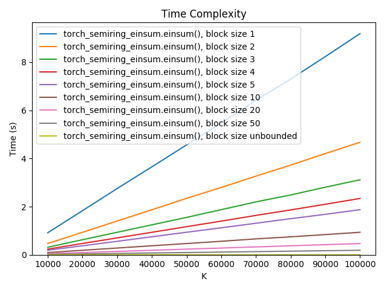
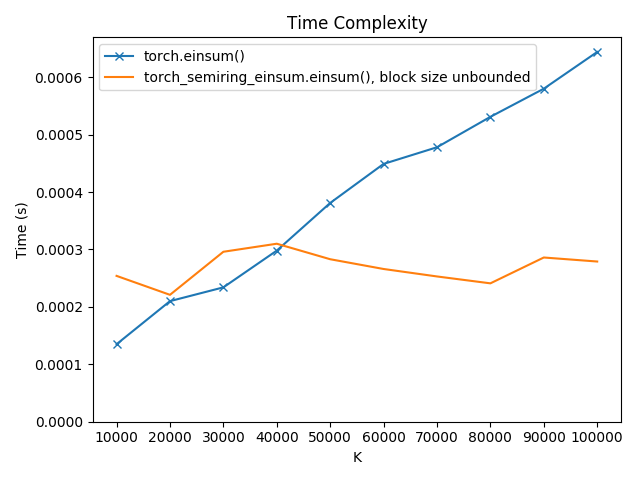
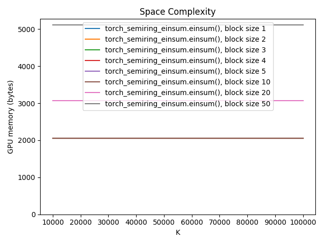

Semiring Einsum (``torch_semiring_einsum``)
===========================================

`View on GitHub <https://github.com/bdusell/semiring-einsum>`_

This is a
`PyTorch <https://pytorch.org/>`__
re-implementation of
`einsum <https://pytorch.org/docs/master/generated/torch.einsum.html>`_
that supports multiple
`semirings <https://en.wikipedia.org/wiki/Semiring>`_.
It includes implementations for the real, log, and Viterbi semirings out of
the box and can be extended to support additional semirings. It can also offer
better performance than the built-in :py:func:`torch.einsum` function and
makes the memory-execution time tradeoff configurable, allowing you to run
large einsum operations that might otherwise be impossible given typical
hardware constraints.

This einsum implementation was specifically designed to be memory-efficient.
Whereas a naive implementation of einsum could easily consume huge amounts of
memory, this implementation has a very conservative memory footprint. It
performs summations in-place and in fixed-size blocks in order to force an
upper bound on memory usage, at the cost of some parallelism. However, the
percentage of memory saved is typically much greater than the percentage of
speed lost. This einsum implementation allows you to set the block size and
tune the tradeoff between memory and speed.

In some cases, this einsum implementation has even better space complexity
than the built-in :py:func:`torch.einsum` function, because it does not need
to create intermediate tensors whose sizes are proportional to the dimensions
being summed over.

.. toctree::
   :maxdepth: 2
   :caption: Contents:

   api

Installation
------------

You can install ``torch_semiring_einsum`` from PyPI using ``pip``:

.. code-block:: sh

   pip install torch_semiring_einsum

or a package manager like `Poetry <https://python-poetry.org/>`_:

.. code-block:: sh

   poetry add torch_semiring_einsum

You can also install it directly from GitHub:

.. code-block:: sh

   pip install git+git://github.com/bdusell/semiring-einsum.git

.. code-block:: sh

   poetry add git+https://github.com/bdusell/semiring-einsum@master

Basic Usage
-----------

Here is a quick example that implements batched matrix multiplication in log
space:

.. code-block:: python

   import torch
   import torch_semiring_einsum

   # Pre-compile an einsum equation.
   EQUATION = torch_semiring_einsum.compile_equation('bik,bkj->bij')
   # Create some parameters to multiply.
   A = torch.log(torch.rand(10, 3, 5, requires_grad=True))
   B = torch.log(torch.rand(10, 5, 7, requires_grad=True))
   # Run einsum.
   C = torch_semiring_einsum.log_einsum(EQUATION, A, B, block_size=5)
   # Now C is differentiable.
   C.sum().backward()

Note that unlike in NumPy or PyTorch, equations are pre-compiled using
:py:func:`~torch_semiring_einsum.compile_equation` rather than re-parsed from
scratch every time einsum is called.

API Documentation
-----------------

For full, detailed API documentation, see :doc:`api`.

What is Einsum?
---------------

The so-called "einsum" function, offered in tensor math libraries such as
`NumPy <https://docs.scipy.org/doc/numpy/reference/generated/numpy.einsum.html>`_,
`TensorFlow <https://www.tensorflow.org/api_docs/python/tf/einsum>`_,
and `PyTorch <https://pytorch.org/docs/stable/torch.html#torch.einsum>`__,
is a function that can be used to express multi-dimensional, linear
algebraic tensor operations with a simple, concise syntax inspired by
`Einstein summation <https://en.wikipedia.org/wiki/Einstein_notation>`_.
It is a very useful kernel that can be used to implement other tensor
operations; for example, the matrix-matrix product of ``A`` and ``B`` can
be implemented as ::

    C = einsum('ik,kj->ij', A, B)

In this example, the first argument to the function is the "equation," and the
lower-case letters ``i``, ``j``, and ``k`` all serve as labels for dimensions
of the tensors ``A``, ``B``, and ``C``. The left side of the equation, ``ik,kj``,
describes the dimensions of the inputs, ``A`` and ``B``; the right side of the
equation, ``ij``, describes the desired shape of the output tensor ``C``. This
means that for each ``i`` and ``j``, entry ``C[i, j]`` will be formed by
multiplying elements from ``A[i, :]`` and ``B[:, j]``. Since the variable
``k`` does not appear in the output, it is "summed out," meaning that each
``C[i, j]`` is the result of computing ``A[i, k] * B[k, j]`` for each
``k``, then summing over the resulting terms.

.. math::

   C_{ij} = \sum_k A_{ik} \times B_{kj}

Einsum can also be used with three or more tensor arguments.

Semirings
---------

It is often useful to swap out addition and multiplication for different
operators that have the same algebraic properties as addition and
multiplication do on real numbers. We can express this using
`semirings <https://en.wikipedia.org/wiki/Semiring>`_. Changing the semiring
used by a piece of code can result in new, useful algorithms. For example,
the `Viterbi Algorithm <https://en.wikipedia.org/wiki/Viterbi_algorithm>`_
and the `Forward Algorithm <https://en.wikipedia.org/wiki/Forward_algorithm>`_
on Hidden Markov Models can be viewed as instances of the same algorithm
instantiated with different semirings.

For a formal definition of semirings and an introduction to semirings in the
context of context-free grammar parsing, see :cite:`goodman1999`.

Einsum Syntax
-------------

This package supports the same einsum equation syntax as
:py:func:`torch.einsum`, except it does not support ellipses (``...``) syntax.

Time and Space Complexity
-------------------------

Consider the einsum equation ``'ak,ak,ak->a'``, where :math:`A` is the size of
the ``a`` dimension and :math:`K` is the size of the ``k`` dimension.
Implementations of einsum in NumPy and PyTorch would compute this by
contracting two tensors at a time, performing two separate tensor
multiplications. This means that they must create an intermediate tensor of
size :math:`A \times K`. There is even a routine in NumPy,
:py:func:`numpy.einsum_path`, which figures out the best contraction order.
However, it should, in principle, be possible to avoid this by summing over
all tensors at the same time. This is exactly what ``torch_semiring_einsum`` does,
and as a result the amount of scratch space the forward pass of einsum requires
remains fixed as a function of :math:`K`.

In addition to performing the summations in the forward and backward passes
in-place, this package implements another important innovation: performing
summations in *blocks* of *fixed size*. Crucially, this allows you to strike a
*balance* between time and memory usage, allowing you to perform einsum
operations that might otherwise be impossible given typical time and GPU memory
constraints.

The fixed-block method is a compromise between two extremes: (a) performing the
summation in-place by iterating over every value of ``k`` one-by-one, and (b)
performing the summation entirely out-of-place by creating an intermediate
tensor with a new ``k`` dimension of size :math:`K`, then summing over ``k`` in
one GPU kernel call. Method (a) is unbearably slow, and method (b) can use
exorbitant amounts of memory that make it impossible to use. The fixed-block
method is like method (a), except that it iterates over fixed-size *ranges* of
``k``. This increases the parallelism and memory requirements of the summation
calculation and decreases the number of GPU kernels launched. Smaller blocks
make einsum behave more like (a), and larger blocks make it behave more like
(b). But in all cases, the fixed block size ensures that the memory
requirements never scale with :math:`K`, so the space complexity for our
example would remain :math:`O(A)` instead of :math:`O(AK)`.

These plots show how the space and time complexity of ``einsum('ak,ak,ak->a')``
(using the real semiring) varies with block size and :math:`K`, the size of
dimension ``k``:

As we can see, execution time gets dramatically better even with small
increases in block size. The built-in :py:func:`torch.einsum` function is still
much faster than the blocked versions, but when the block size is unbounded
and the summation is fully parallel, it is even faster.

.. image:: space-complexity.png

For our example, the built-in einsum implementation uses the same amount of
memory as the fully out-of-place einsum (this is true for this specific
equation, but it does not generally hold true for all equations). Crucially,
the blocked einsum implementation has constant, rather than linear, space
complexity, opening up a new world of possible einsum operations.

Indexes
-------

* :ref:`genindex`
* :ref:`modindex`
* :ref:`search`

Bibliography
------------

.. bibliography:: references.bib
